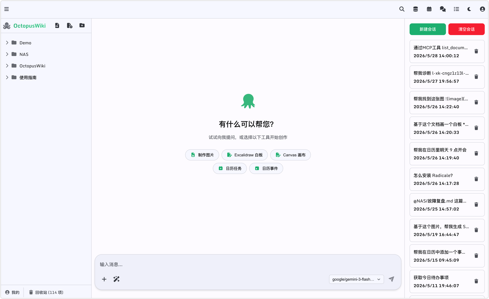
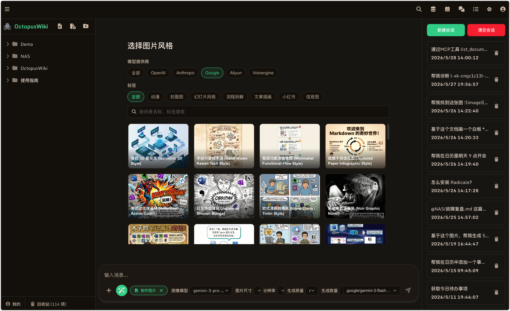
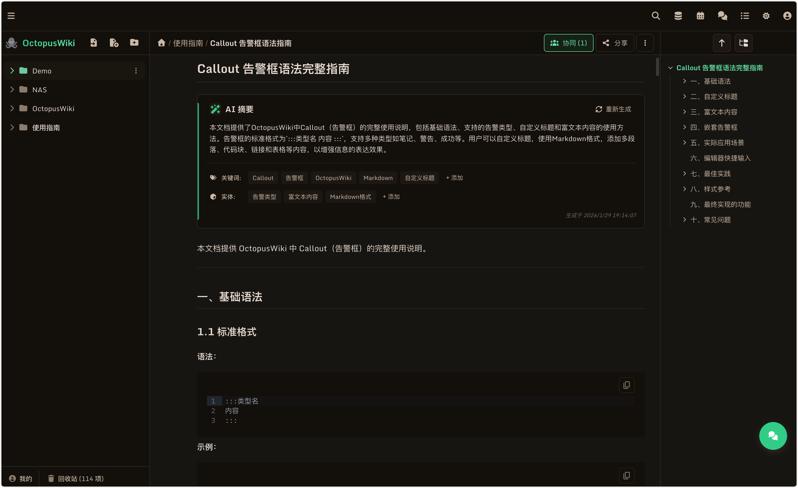
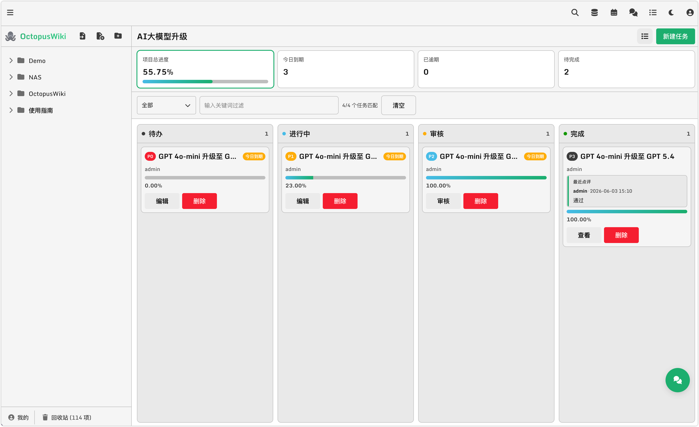
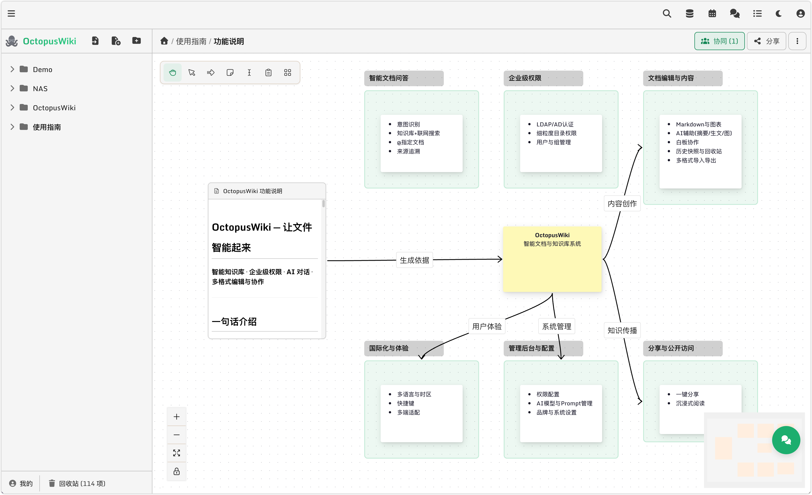
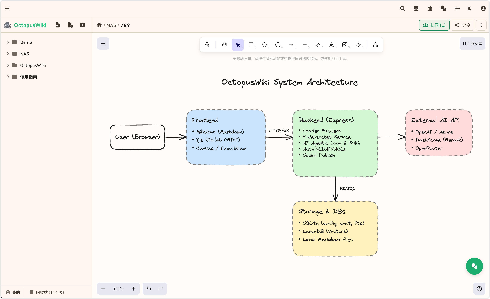
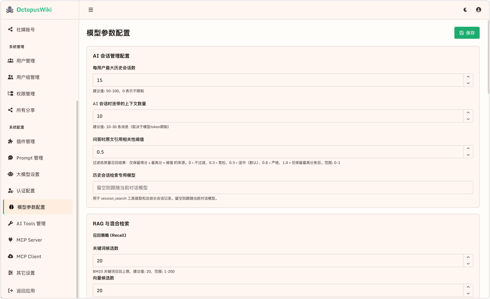

# 🐙 OctopusWiki

<div align="center">
  
</div>

> **让文档智能起来** — 一个集 Markdown 知识库、实时协作、AI 助手、日历、提醒事项、项目看板、社媒发布于一体的**私有部署**协作平台。


---

## 📖 它是什么

OctopusWiki 不是又一个 wiki。它把过去要装 6 个工具(Notion + Confluence + Trello + 提醒事项 + ChatGPT + 微信编辑器)才能凑齐的体验,装进了**同一个登录态、同一份 ACL、同一台你自己的服务器**:

- ✍️ **Milkdown 协作编辑器** — 多人实时同改,字符级合并,永远不会冲突
- 🔍 **双引擎混合检索** — SQLite FTS5(关键词) + LanceDB(向量)+ RRF 融合 + Rerank
- 🤖 **Agentic AI 助手** — 12 个可治理工具 + 4 个创意工具,跨会话长期记忆
- 🎨 **AI 配图** — OpenAI / Azure / Google Imagen / OpenRouter 一键生成
- 🗓️ **CalDAV 日历提醒** — 内置 CalDAV 服务端,macOS / iOS / Thunderbird 直连
- 📋 **项目看板** — 状态机 + 子任务进度卷积 + 评审工作流
- 🎯 **无限白板** — Excalidraw 白板
- 🎯 **无限画布** — Canvas 画板
- 📢 **一键发布** — 微信公众号 + WordPress
- 🔐 **企业级权限** — LDAP/AD + App Password + 路径继承 ACL

> **核心理念**:数据始终留在你的服务器,**不依赖任何外部 DB**(没有 MySQL、没有 Redis、没有 Elasticsearch)。

---

## ✨ 三分钟看清能力


| 能力 | 你能做的事 |
|------|------|
| **Markdown 编辑** | 数学公式(KaTeX)、Mermaid 流程图、PlantUML、Callout 高亮块、代码高亮、Wiki 双链 `[[]]`、任务列表、可视化表格 |
| **富媒体** | 拖拽上传图片/视频/PDF/Excel 自动生成卡片,Video.js 播放器内嵌,媒体源信息追踪 |
| **AI 创作** | AI 润色、AI 翻译、AI 摘要自动生成、AI 配图(4 大 provider)、文生图 + 图生图 |
| **AI 助手** | 知识库问答带引用、跨会话搜索、长期记忆、@提及文档作上下文、自然语言建提醒 |
| **协作** | 多光标实时同步、只读用户可在场、字符级合并、网络抖动自动重连 |
| **视图** | 文件树 / 资源管理器 / AI Chat / 项目看板 / Excalidraw 白板 / Canvas 无限画布 / 日历 / 7 种 |
| **版本** | 自动定时快照 + 手动快照 + 任意版本对比恢复 + 30 天回收站 |
| **分享** | 有效期可控(1天~永久) + 可选密码 + 无需登录访问 |
| **发布** | 一键发布到微信公众号(自动压图改格式)+ WordPress（支持对象存储） |
| **同步** | 提醒事项**直接同步到 iPhone / macOS Calendar**(CalDAV) |
| **主题** | 浅色/深色 × Crepe/Nord/Frame = 6 种组合 + 3 语言(zh-CN/zh-TW/en-US) |

---

## ✨ 部份截图

<div align="center">
  
</div>

<div align="center">
  
</div>

<div align="center">
  
</div>

<div align="center">
  
</div>

<div align="center">
  
</div>

<div align="center">
  
</div>

<div align="center">
  
</div>

---

## 🚀 快速开始

### 用 Docker(推荐)

```bash
# 克隆仓库
git clone https://github.com/VebinLee/OctopusWiki-Docker.git
# 进入服务目录
cd OctopusWiki-Docker
# 启动服务
docker compose up -d
# 进入容器，导入提示词数据
docker exec -it octopuswiki bash
sqlite3 /app/data/db/config.db < /app/md/prompt_templates.sql
# 删除提示词SQL
rm -rf /app/md/prompt_templates.sql
# 退出容器
exit

# 访问 http://localhost:3000
# 默认管理员:admin / admin123(注意⚠️：进入后台管理后，立即修改超管密码)

# 如果需要 Word、PDF 等导入功能，需要启用 docconvert 服务
cd OctopusWiki-Docker/docconvert
cp .env.example .env
docker compose up -d

# Logo 设置
在后台管理--其它设置--上传 Logo 文件夹的 Logo 即可
```

---

## 🗄️ 数据存储一览

| 存储 | 路径 | 用途 | 可重建? |
|------|------|------|------|
| `config.db` | `data/db/` | 用户 / 组 / ACL / App Password / 系统配置 | ❌ **必须备份** |
| `snapshots.db` | `data/db/` | 文档版本快照 | ❌ 备份 |
| `chat.db` | `data/db/` | 聊天会话 + 消息 + FTS5 召回索引 | ✅ 可重建(损失对话历史) |
| `memory.db` | `data/db/` | AI 长期记忆(双桶:用户画像 + 工作笔记) | ✅ |
| `calendar.db` | `data/db/` | 日历事项 + CalDAV 订阅(密码 AES-256-GCM) | ⚠️ 含订阅密码 |
| `projects.db` | `data/db/` | 看板项目 + 任务 + 评审 | ⚠️ 备份 |
| `search.db` | `data/db/` | 全文 FTS5 索引(中文 jieba 分词) | ✅ 启动自愈重建 |
| `lancedb/` | `data/` | 向量索引(Apache Arrow) | ✅ 启动自愈重建 |
| `md/` | 项目根 | Markdown 源文件 + 附件 + Excalidraw + Canvas | ❌ **核心资产** |

> 💡 **迁移很简单**:把 `data/` + `md/` + `plugins/` 复制到新机器即可。

---

## 🛠️ 主要功能模块

### Markdown 编辑器

- **KaTeX 数学公式**:`$inline$` 与 `$$block$$`
- **Mermaid / PlantUML / Diagram-Code**:代码块即图,实时渲染
- **Callout 高亮块**:`:::tip` `:::warning` `:::danger` 等 6 种风格
- **Wiki 双链 `[[]]`**:输入即弹搜索面板,文档改名自动同步
- **资源卡片化**:图片/视频/文件全部升级为可操作卡片(复制/下载/原图)
- **AI 摘要插件**:文档顶部自动生成摘要,写入 frontmatter
- **30+ 语言代码高亮**:Prism.js 主题随编辑器主题切换

### 实时协作(Yjs CRDT)

- 文档 / Excalidraw / 无限画布**共用同一 WebSocket 通道**
- 字符级合并 — 永远不弹出"合并冲突"
- 只读用户可加入会话看光标,但**服务器在 WS 层拦截写消息**
- 协作消息上限 50 MB,适配大白板大画布
- 自定义 `YjsService` 集成 ACL 校验

### 双引擎混合检索

```
查询 ─┬─ SQLite FTS5(BM25,关键词)  ──┐
      └─ LanceDB(余弦相似度,向量)   ──┴─► RRF 融合(k=60) → Rerank → 返回 topK
```

- **中文分词**:libsimple(jieba)扩展自动加载,降级 unicode61
- **多模态图片检索**:既能图向量搜图,也能 VLM 描述后做文本召回
- **增量更新**:chokidar 监控 + MD5 哈希去重,只重算改过的文件
- **可调参**:`SEARCH_RRF_K` / `SEARCH_KEYWORD_WEIGHT` / `SEARCH_VECTOR_WEIGHT`

### AI 助手(Agentic Loop)

**12 个 Agentic 工具**(每个都可在后台启停):

| 工具 | 用途 |
|------|------|
| `knowledge_search` | 混合检索知识库 |
| `knowledge_search_by_image` | 多模态图片召回 |
| `read_document` | 读完整文档 |
| `get_conversation_sources` | 取本次对话引用 |
| `web_search` / `web_fetch` | 联网搜索 / URL 抓取(默认关闭) |
| `session_search` | 跨历史会话召回 + LLM 摘要 |
| `memory` | 持久化用户偏好 |
| `create/list/update/delete_calendar_todo` | 自然语言操作日历提醒 |

**4 个创意工具**:文本生图 / 图生图 / 文生视频 / 视频继续帧

**SSE 事件类型**:`thinking` / `thinking_done` / `content` / `tool_status` / `sources` / `error` / `[DONE]`

**思考模型双兼容**:OpenAI `reasoning_content` + DeepSeek-R1 / QwQ `<think>` 标签解析

### 长期记忆 + 跨会话召回

- 独立 `memory.db`,**清空对话不失忆**
- 双桶设计:`user`(画像/偏好)+ `memory`(工作笔记)
- 写入前 3 重安全扫描:零宽字符 / Prompt Injection / 超长行
- 跨会话搜索基于 `chat_messages_fts` + LLM 摘要,**不返回原始消息**

### 认证与权限

- 4 种认证:**Basic + LDAP/AD + App Password + Session**
- LDAP StartTLS + 用户名严格转义,本地 admin 永远走 Basic 兜底
- App Password:供 CalDAV / iOS / Thunderbird 等外部客户端
- ACL 路径继承,`deny > manage > write > read`,**空 ACL 默认拒绝**
- 4 级权限:`read` / `write` / `manage` / `deny`

### 日历提醒(VTODO + RRULE + CalDAV)

- 6 个 RRULE 预设(每天/工作日/每周/每月/每年/自定义)
- **内建 CalDAV 服务端**(RFC 4791/6578)— macOS / iOS / Thunderbird / DAVx⁵ 直连
- **订阅式 CalDAV 客户端**:把外部企业日历定时拉到本地
- 凭据 AES-256-GCM 加密存储

### 项目看板

- 状态机:**todo → doing → review → done**
- 子任务进度自动卷积到父任务
- 评审工作流:`approve` / `send-back` / `reopen`
- 看板与文件夹绑定,**ACL 复用**(配权限一次,管两边)
- per-project SSE 实时广播

### 社媒发布

- **微信公众号**:自动压图(2 MB / 5 MB 限额)、代码块重排、素材库上传
- **WordPress**:REST API,选分类/标签/特色图
- 凭据 AES-256 加密存储

### 分享与导出

- 分享链接:有效期 1 天~永久 / 可选密码 / 一键失效
- 导出:Markdown 原件 / 单文件 HTML / PDF
- 导入:基于 docconvert 微服务,Word/Excel/PPT/PDF/HTML/EPUB → Markdown

---

## 📄 许可证与授权

OctopusWiki 面向不同使用场景提供差异化授权方式：

- **个人使用/非商业用途**：可免费使用与部署
- **企业使用/商业用途**：需取得 OctopusWiki 的**商业授权**（包括但不限于：生产环境商用部署、对外提供服务、作为企业内部/对客户交付的系统组成部分、以及任何以营利或商业目的为导向的使用）

如需获取商业授权、报价与合作支持，请联系项目维护方。

---

## 💬 联系

- 问题: GitHub Issues
- 商业合作 / 私有部署咨询:[微信：VebinLee Email:Vebinlee@qq.com]

---

## 版本更新

### v1.1

- Markdown AI 工具新增文本翻译与润色功能。
- 修复右侧文件树在切换文件与文件夹时，因状态管理导致的同时高亮问题。
- 修复文档导入的 URL 地址问题，改为使用环境变量 `DOCCONVERT_URL`。
- 在 `docker-compose.yml` 中新增 docconvert 服务的环境变量配置。
- 修复文件树中文件夹的右键菜单与“更多”菜单内容不一致的问题。

### v1.2

- 修复后台管理 Logo 名称未随“其他设置 > 品牌设置 > 系统标题”同步更新的问题。
- 移除 AI 润色与翻译的最大 Token 限制，避免内容输出中断或不完整的情况。
- AI 润色与翻译时将保留原 Markdown 格式输出。
- 修复 Markdown 列表中双击回车时的换行异常问题。

### v1.3

- PC 端项目看板新增右键菜单“新建任务”功能。
- 增强项目看板的进度管理功能，支持在新建任务时直接设置任务进度。
- 修复了在回收站中点击“查看”项目看板时，弹出“项目不存在”提示的问题。
- 实现了文件树中的 Markdown 文件名与文档 H1 标题的双向联动。
- 增强了 Canvas、Excalidraw、项目看板、图片及视频等其他类型文件的重命名联动功能。
- 修复了新建 Markdown 文档时，光标未能自动定位至下一行的问题。

### v1.4

- 修复 Markdown 文件名与文档 H1 标题双向联动时，导致文件树重复刷新加载的问题。
- Chat 模式新增对 Gemini 原生 API 的接入支持，并引入思考等级设置（Minimal / Low / Medium / High）。前端 UI 现已支持选择思考等级：Medium（标准）与 High（扩展）。
- 将 Agentic Loop 抽离为独立模块，并将分散的 `<think>` 流式解析逻辑合并为单一共享模块。
- 优化项目看板进度计算逻辑：当任务包含子任务时，总进度设为只读状态，并根据子任务的进度实时联动计算。
- 优化项目看板任务描述的交互体验：新建任务时，描述信息默认为编辑状态；编辑已有任务时，描述信息默认为预览状态。
- 修复了 AI 生图功能中输入英文提示词却生成中文图片的问题，确保中英文提示词均能准确生成对应语言环境的图片。
- 修复了 AI 生图功能中图片插入至下一段落时出现的异常问题。

### v1.5

- 增强前端页面快捷键支持。
- 新增项目看板文件创建与删除的 SSE 广播功能。
- 新增项目看板文件的批量移动与删除等操作。
- 新增在根目录下创建项目看板文件的功能。


<p align="center">
  <strong>OctopusWiki</strong> · 让 AI 真正住进你的知识库 🐙
</p>
